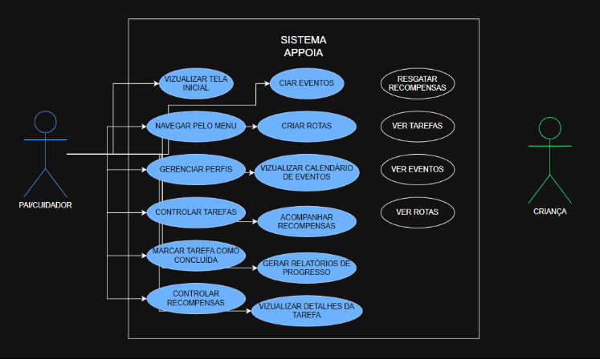
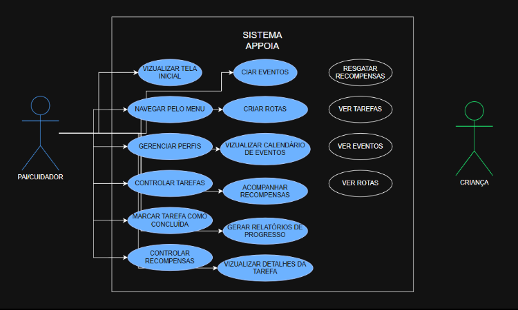
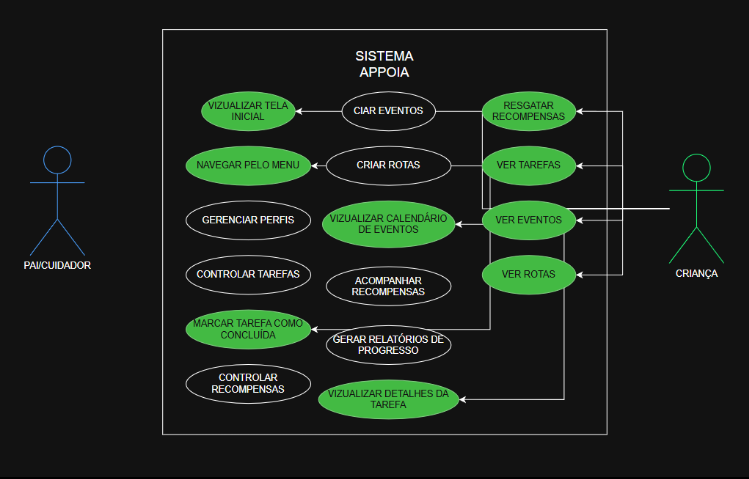
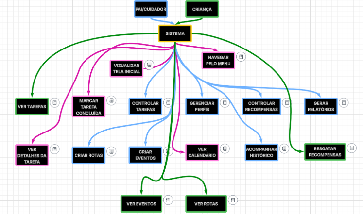

# Casos de Uso 

## 1. Introdução

Este documento detalha os casos de uso do sistema Appoia, baseado no documento de requisitos do sistema. Seu objetivo é ilustrar em forma de UML as interações do sistema com os usuários.

## 2. Atores do Sistema

Apresenta os principais usuários (atores) que interagem com o sistema, com suas descrições e responsabilidades.

* **Pai/Cuidador:**
* Cria e gerencia tarefas, recompensas, eventos e rotas.
* Acompanha o progresso da criança.
* **Criança:**
* Interage com o conteúdo criado pelos pais.
* Marca tarefas como concluídas e resgata recompensas.

### Diagrama de Caso de Uso Geral

## 3. Descrição dos Casos de Uso

A seguir, apresentamos os casos de uso do sistema agrupados por ator.

### 3.1 Casos de Uso – Pai/Cuidador

| ID | Caso de Uso |
| :--- | :--- |
| UC01 | Visualizar tela inicial |
| UC02 | Navegar pelo menu lateral |
| UC03 | Gerenciar perfis de filhos |
| UC04 | Criar/editar/excluir tarefas |
| UC05 | Marcar tarefa como concluída |
| UC06 | Criar/editar/excluir recompensas |
| UC07 | Criar eventos |
| UC08 | Criar rotas |
| UC09 | Visualizar calendário de eventos e tarefas |
| UC10 | Acompanhar histórico de recompensas |
| UC11 | Gerar relatórios de progresso |

### 3.2 Casos de Uso – Criança

| ID | Caso de Uso |
| :--- | :--- |
| UC12 | Visualizar tela inicial |
| UC13 | Navegar pelo menu lateral |
| UC14 | Visualizar tarefas |
| UC15 | Marcar tarefa como concluída |
| UC16 | Visualizar detalhes da tarefa |
| UC17 | Visualizar e resgatar recompensas |
| UC18 | Visualizar eventos |
| UC19 | Visualizar rotas no mapa |
| UC20 | Visualizar calendário consolidado |

## 4. Regras de Negócio

Regras de negócio mapeadas aos seus respectivos casos de uso.

| ID | Regra de Negócio | Aplicada em |
| :--- | :--- | :--- |
| RN01 | Criança só pode resgatar recompensa se tiver pontos suficientes. | UC17  |
| RN02 | Ao resgatar, pontos são subtraídos. | UC17  |
| RN03 | Valor em pontos de uma tarefa não pode ser negativo. | UC04  |
| RN04 | Tarefa não pode ser concluída duas vezes. | UC15  |

## 5. Requisitos Funcionais Mapeados

Mapeamento entre os Requisitos Funcionais (RF) e os Casos de Uso (UC).

| Requisito | Caso de Uso |
| :--- | :--- |
| RFPAI-01 | UC01  |
| RFPAI-02 | UC02  |
| RFPAI-03 | UC03  |
| RFPAI-04/05 | UC04  |
| RFPAI-06 | UC05  |
| RFPAI-07/08 | UC06  |
| RFPAI-09 | UC07  |
| RFPAI-10 | UC08  |
| RFPAI-11 | UC09  |
| RFPAI-12 | UC10  |
| RFPAI-13 | UC11  |
| RFCRI-01 | UC12  |
| RFCRI-02 | UC13  |
| RFCRI-03 | UC14  |
| RFCRI-04/05 | UC15/16  |
| RFCRI-06/07 | UC17  |
| RFCRI-08 | UC18  |
| RFCRI-09 | UC19  |
| RFCRI-10 | UC20  |

## 6. Requisitos Não Funcionais

| ID | Categoria | Requisito |
| :--- | :--- | :--- |
| RNF01 | Usabilidade | A interface deve ser simples, clara e intuitiva, adaptada para usuários com diferentes níveis de familiaridade com tecnologia.  |
| RNF02 | Acessibilidade | A apresentação da rotina deve usar recursos visuais adequados para facilitar o entendimento por crianças, incluindo crianças com TEA (Transtorno do Espectro Autista).  |
| RNF03 | Desempenho | O tempo de resposta das interações principais (como abrir uma tela ou marcar tarefa) deve ser inferior a 2 segundos.  |
| RNF04 | Confiabilidade | O sistema deve sincronizar os dados entre os dispositivos dos pais e das crianças de forma íntegra, sem perdas, quando houver conexão com a internet.  |
| RNF05 | Segurança | Os dados dos usuários devem ser armazenados de forma segura. O acesso ao sistema deve ser protegido por autenticação (login e senha).  |
| RNF06 | Portabilidade | O sistema deve ser desenvolvido como aplicativo móvel compatível com Android e iOS.  |
| RNF07 | Conectividade | A sincronização de dados e o envio de notificações devem funcionar com conexão ativa à internet.  |
| RNF08 | Manutenibilidade | O código-fonte deve seguir boas práticas de desenvolvimento para facilitar manutenção, evolução e correções futuras.  |

## 7. Fluxos de Navegação

Mostra como o usuário navega pelas telas do sistema.

### Pai/Cuidador - Fluxos de Navegação

**1. Cadastro e Acesso**

* Acessa tela inicial → Escolhe "Criar Conta" → Preenche nome, e-mail, senha → Confirma cadastro
* **Ou:** Acessa tela inicial → Escolhe "Login" → Preenche e-mail/senha → Acesso concedido → Vai para a tela de boas-vindas

**2. Navegação pelo Menu Lateral**

* Abre menu lateral → Seleciona:
  * Meus Filhos
  * Definir Tarefas
  * Definir Recompensas
  * Definir Eventos
  * Definir Rotas
  * Calendário
  * Notificações

**3. Gestão de Filhos**

* Menu → Meus Filhos → Visualiza lista → Clica "Adicionar Filho" → Preenche nome e e-mail → Filho adicionado
* Clica em filho → Visualiza relatório (tarefas concluídas, pontos, recompensas)

**4. Gestão de Tarefas**

* Menu → Definir Tarefas → Visualiza tarefas por filho
* Criar tarefa → Preenche nome, pontos, prazo, filhos
* Editar tarefa
* Excluir tarefa
* Marcar tarefa como concluída

**5. Gestão de Recompensas**

* Menu → Definir Recompensas → Visualiza lista
* Criar recompensa
* Editar recompensa
* Excluir recompensa

**6. Gestão de Eventos**

* Menu → Definir Eventos
* Ver eventos por filho
* Criar evento
* Editar/Excluir evento
* Marcar como concluído

**7. Gestão de Rotas**

* Menu → Definir Rotas
* Criar rota (origem, destino, data, filho)
* Editar/Excluir rota

**8. Calendário**

* Menu → Calendário → Visualiza todos os eventos e tarefas dos
filhos em modo de agenda

**9. Notificações**

* Menu → Notificações → Visualiza recompensas resgatadas pelos
filhos
* Opção de excluir recompensas resgatadas

### Fluxograma de Navegação

