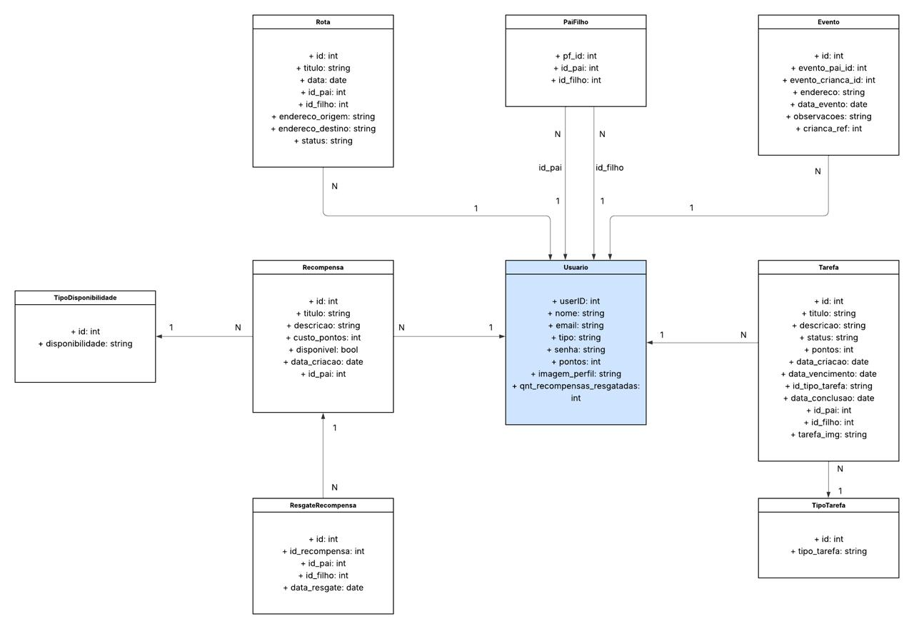

# Modelo de Dados (Diagrama de Classes)

O diagrama a seguir representa a estrutura estática dos dados do aplicativo Appoia. Ele ilustra as principais entidades (classes), seus atributos e como elas se relacionam entre si.

